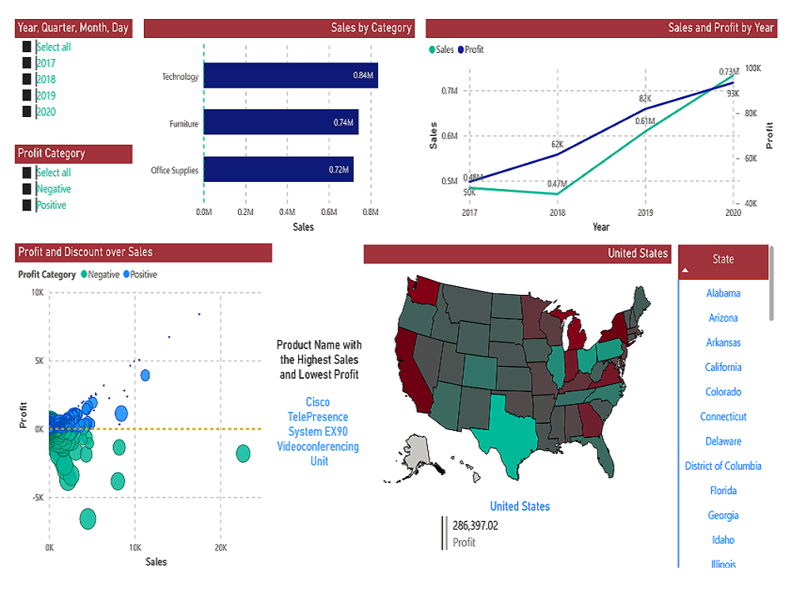

# 📊 Product Sales & Profit Analysis — Superstore (Power BI)

A Power BI dashboard that analyzes 2017–2020 retail sales performance, identifies underperforming regions, and uncovers profit margin trends across product categories. [11][12]



---

## 🎯 Project Overview

**Business Objective**  
To evaluate sales and profit dynamics in a retail superstore from 2017 to 2020, pinpoint categories and states driving profitability (or losses), and support data-driven decisions on pricing, discounts, and regional focus. [10][12]

**Data Source**  
- **Dataset**: Superstore retail transactions (Excel)  
- **Volume**: ~10,000 transaction logs  
- **Timeframe**: 2017–2020  
- **Key Fields**: Order Date, Category, Sub-Category, Sales, Profit, Discount, State, Quantity  

**Tools Used**  
- Microsoft Power BI Desktop (.pbix)  
- Excel (source data)  

---

## 📈 Key Features & Visualizations

The workbook includes interactive visuals designed to support drill-down analysis and executive summaries. [10][15]

| Visual | Purpose | Key Design Choices |
|--------|---------|--------------------|
| **Bar Chart: Sales by Category** | Compare total sales across product categories (e.g., Furniture, Office Supplies, Technology) | Sorted descending for quick identification of top revenue drivers |
| **Line Graph: Profit vs Sales by Year** | Track year-over-year trends in sales and profit | Dual-line format to highlight divergence (e.g., 2018 profit dip) |
| **Bubble Chart: Profit & Discount over Sales** | Analyze how discount levels correlate with profit performance | Color-coded bubbles: <span style="color:#d9534f;">■</span> negative profit vs <span style="color:#5cb85c;">■</span> positive profit |
| **Filled Map: Profit by State** | Identify geographic hotspots and underperformers | Transitional color scale (red → yellow → green) for intuitive profit gradient |

> 💡 All visuals support cross-filtering: click a category, state, or year to update the entire report context. [1][5]

---

## 🔍 Key Business Insights

Analysis of the Superstore dataset reveals three high-impact findings: [10][12]

1. **Sales grew consistently (2017–2020), but profit volatility signals pricing/discount risks**  
   Sales rose year-over-year, yet profit hit an all-time low in 2018 before recovering and surpassing sales by 2020. This suggests aggressive discounting or cost pressures in specific categories during 2018. [11]

2. **Category-level profit leakage is concentrated in Furniture and select Sub-Categories**  
   Drill-downs show that while Furniture drives high sales volume, its profit margin is disproportionately low—often negative when discounts exceed 15%. [12]

3. **Geographic profit disparity: Central & Southern states underperform**  
   The state map highlights clusters of negative profit in regions like Texas, Ohio, and North Carolina, whereas California and New York remain consistently profitable despite high sales volume. [11]

These insights enable targeted actions: revise discount thresholds for low-margin categories, renegotiate supplier costs for Furniture, and investigate logistics or demand issues in underperforming states. [12][15]

---

## 🚀 How to Use This Dashboard

### Prerequisites
- **Microsoft Power BI Desktop** (free download)  
  → [Download Power BI Desktop](https://powerbi.microsoft.com/desktop/) [1][5]

### Step-by-Step Instructions

1. **Clone or download the repository**  
   ```bash
   git clone https://github.com/your-username/Product-s-Sales-and-Profit-Analysis-of-Super-store.git
   ```
   Or click **Code → Download ZIP** on GitHub and extract the folder. [14]

2. **Open the .pbix file**  
   - **Option A (Double-click)**: Navigate to the `.pbix` file and double-click it. Windows will launch Power BI Desktop automatically. [9][13]  
   - **Option B (From Power BI Desktop)**:  
     1. Open **Power BI Desktop**  
     2. Go to **File → Open report → Browse reports**  
     3. Select `Product-s-Sales-and-Profit-Analysis-of-Super-store.pbix`  
     4. Click **Open** [1][5]

3. **Refresh data (if needed)**  
   If you replace the source Excel file:  
   - In Power BI Desktop, go to **Home → Transform data → Data source settings**  
   - Update the file path to your new Excel source  
   - Click **Refresh** to reload the model [8]

4. **Explore interactively**  
   Use slicers, cross-filtering, and tooltips to investigate categories, years, and states. [1][5]

---

## 📁 Repository Structure

